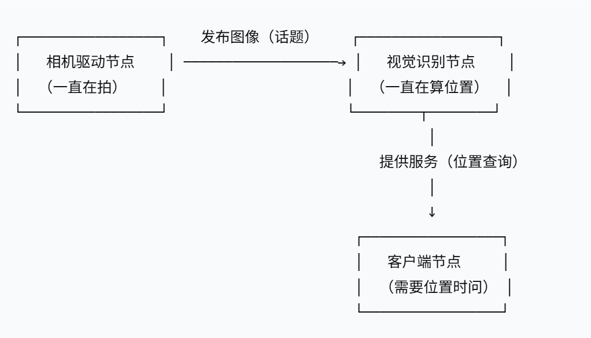

# 概念总览

# 工作空间
+ 我们针对机器人某些功能进行代码开始时，各种编写的代码、参数、脚本等文件，也需要放置在某一个文件夹里进行管理，这个文件夹在ROS系统中就叫做工作空间。
+ 一个典型的工作空间
>  dev_ws
 >>  + src，代码空间，未来编写的代码、脚本，都需要人为的放置到这里
  >> + build，编译空间，保存编译过程中产生的中间文件
  >> + install，安装空间，放置编译得到的可执行文件和脚本
  >> + log，日志空间，编译和运行过程中，保存各种警告、错误、信息等日志

总体来讲，这四个空间的文件夹，我们绝大部分操作都是在src中进行的，编译成功后，就会执行install里边的结果，build和log两个文件夹用的很少。
## 创建工作空间
```
 mkdir -p ~/dev_ws/src
 cd ~/dev_ws/src
 git clone https://gitee.com/guyuehome/ros2_21_tutorials.git
```
## 自动安装依赖
```
 sudo apt install -y python3-pip
 sudo pip3 install rosdepc
 sudo rosdepc init
 rosdepc update
 cd ..
 rosdepc install -i --from-path src --rosdistro humble -y
```
依赖：借用很多现成的功能包
## 编译工作空间
依赖安装完成后，就可以使用如下命令编译工作空间啦
```
 sudo apt install python3-colcon-ros
 cd ~/dev_ws/
 colcon build
```
## 设置环境变量
编译成功后，为了让系统能够找到我们的功能包和可执行文件，还需要设置环境变量：
```
 source install/local_setup.sh # 仅在当前终端生效
 echo " source ~/dev_ws/install/local_setup.sh" >> ~/.bashrc # 所有终端均生效
```
*至此，我们就完成了工作空间的创建、编译和配置。*
# 功能包
把不同功能的代码划分到不同的功能包中，尽量降低他们之间的耦合关系
## 创建功能包
```
 ros2 pkg create --build-type <build-type> <package_name>
```
+ pkg：表示功能包的功能；
+ create：表示创建功能包；
+ build-type：表示新创建的功能包是C++还是Python的；
  + C++/C  :ament_cmake
  + Python  :ament_python
+ package_name：功能包的名字。
>比如在终端中分别创建C++和Python版本的功能包：
>```
> cd ~/dev_ws/src
> ros2 pkg create --build-type ament_cmake learning_pkg_c               # C++
> ros2 pkg create --build-type ament_python learning_pkg_python # Python
>```
## 编译功能包
```
 cd ~/dev_ws
 colcon build   # 编译工作空间所有功能包
 source install/local_setup.bash
```
## 功能包的结构
功能包并不是普通的文件夹，那如何判断一个文件夹是否是功能包呢？我们来分析下刚才新创建两个功能包的结构。
### C++功能包
C++类型的功能包，其中必然存在两个文件：package.xml和CMakerLists.txt。
+ package.xml包含功能包的版权描述，和各种依赖的声明。
+ CMakeLists.txt文件是编译规则，C++代码需要编译才能运行，所以必须要在该文件中设置如何编译，使用CMake语法。
### Python功能包
C++功能包需要将源码编译成可执行文件，但是Python语言是解析型的，不需要编译，所以会有一些不同，但也会有这两个文件：package.xml和setup.py。
+ package.xml文件的主要内容和C++版本功能包一样，包含功能包的版权描述，和各种依赖的声明。
+ setup.py文件里边也包含一些版权信息，除此之外，还有“entry_points”配置的程序入口，后续编程讲解中，课程会介绍如何使用。

*工作空间（dev_ws）= 一个小区*

*功能包（learning_node）= 小区里的一栋楼*

*代码文件（node_helloworld.py）= 楼里的一个房*
# 节点
指机器人的各种功能
## 节点和功能包的区别
learning_node/                    ← 功能包（整个文件夹）  
├── package.xml                   ← 包的信息  
├── setup.py                      ← 包的安装配置  
├── learning_node/                ← Python源码文件夹  
│   ├── __init__.py  
│   ├── node_helloworld.py        ← 节点1的代码  
│   └── node_goodbye.py           ← 节点2的代码    
└── resource/  
**节点是一段正在运行的程序：**
+ 当你执行 ros2 run learning_node node_helloworld 时，node_helloworld.py 就跑起来了，变成一个节点。
+ 同一个 .py 文件，你可以同时运行多次，每次运行都是一个独立的节点（就像同一个厨师食谱，两个厨师同时照着做）
## 通信模型
+ 节点在机器人系统中的职责就是**执行某些具体的任务**，从计算机操作系统的角度来看，也叫做进程；
+ 每个节点都是一个可以**独立运行的可执行文件**，比如执行某一个python程序，或者执行C++编译生成的结果，都算是运行了一个节点；
+ 既然每个节点都是独立的执行文件，那自然就可以想到，得到这个执行文件的**编程语言可以是不同的**，比如C++、Python，乃至Java、Ruby等更多语言。
+ 这些节点是功能各不相同的细胞，根据系统设计的不同，可能位于计算机A，也可能位于计算机B，还有可能运行在云端，这叫做**分布式**，也就是可以分布在不同的硬件载体上；
+ 每一个节点都需要有**唯一的命名**，当我们想要去找到某一个节点的时候，或者想要查询某一个节点的状态时，可以通过节点的名称来做查询
## 案例一：Hello World节点（面向过程）
### 代码
```
 ros2 run learning_node node_helloworld
 ```
### 代码解析
现在应该还不用看懂  
```
#!/usr/bin/env python3 
# -*- coding: utf-8 -*-

"""
@作者: 古月居(www.guyuehome.com)
@说明: ROS2节点示例-发布“Hello World”日志信息, 使用面向过程的实现方式
"""

import rclpy                                   # ROS2 Python接口库
from rclpy.node import Node                    # ROS2 节点类
import time

def main(args=None):                           # ROS2节点主入口main函数
    rclpy.init(args=args)                      # ROS2 Python接口初始化
    node = Node("node_helloworld")             # 创建ROS2节点对象并进行初始化

    while rclpy.ok():                          # ROS2系统是否正常运行
        node.get_logger().info("Hello World")  # ROS2日志输出
        time.sleep(0.5)                        # 休眠控制循环时间

    node.destroy_node()                        # 销毁节点对象    
    rclpy.shutdown()                           # 关闭ROS2 Python接口
```

完成代码的编写后需要设置功能包的编译选项（登记信息），让系统知道Python程序的入口，打开功能包的setup.py文件，加入如下入口点的配置：
```
entry_points={                # 总导购牌（固定）
    'console_scripts': [      # 负责终端命令的分组标题（固定）
        'node_helloworld = learning_node.node_helloworld:main',  # 具体某一条服务（你可以加很多条）
    ],
}
```
### 创建节点流程
想要实现一个节点，代码的实现流程是这样做：
+ 编程接口初始化
+ 创建节点并初始化
+ 实现节点功能
+ 销毁节点并关闭接口
## 案例二：Hello World节点（面向对象）
**在ROS2的开发中，更推荐使用面向对象的编程方式**
### 代码
```
 ros2 run learning_node node_helloworld_class
 ```
### 代码解析
程序的结构发生了变化
```
#!/usr/bin/env python3
# -*- coding: utf-8 -*-

"""
@作者: 古月居(www.guyuehome.com)
@说明: ROS2节点示例-发布“Hello World”日志信息, 使用面向对象的实现方式
"""

import rclpy                                     # ROS2 Python接口库
from rclpy.node import Node                      # ROS2 节点类
import time

"""
创建一个HelloWorld节点, 初始化时输出“hello world”日志
"""
class HelloWorldNode(Node):
    def __init__(self, name):
        super().__init__(name)                     # ROS2节点父类初始化
        while rclpy.ok():                          # ROS2系统是否正常运行
            self.get_logger().info("Hello World")  # ROS2日志输出
            time.sleep(0.5)                        # 休眠控制循环时间

def main(args=None):                               # ROS2节点主入口main函数
    rclpy.init(args=args)                          # ROS2 Python接口初始化
    node = HelloWorldNode("node_helloworld_class") # 创建ROS2节点对象并进行初始化
    rclpy.spin(node)                               # 循环等待ROS2退出
    node.destroy_node()                            # 销毁节点对象
    rclpy.shutdown()                               # 关闭ROS2 Python接口
```
完成代码的编写后需要设置功能包的编译选项，让系统知道Python程序的入口，打开功能包的setup.py文件，加入如下入口点的配置：
```
   entry_points={
        'console_scripts': [
         'node_helloworld       = learning_node.node_helloworld:main',
         'node_helloworld_class = learning_node.node_helloworld_class:main',
        ],
   }
```
### 创建节点流程
同样：
+ 编程接口初始化
+ 创建节点并初始化
+ 实现节点功能
+ 销毁节点并关闭接口
## 节点命令行操作
常用操作如下：
```
ros2 node #命令的帮助信息（告诉你这个命令有哪些子命令）
ros2 node list               # 查看节点列表
ros2 node info <node_name>   # 查看节点信息
```
# 话题
节点间传递数据的桥梁
## 通信模型
### 发布/订阅模型
每一个话题都需要有一个名字，传输的数据也需要有固定的数据类型。  
有点像报纸
+ 发布者:发送数据的对象
+ 订阅者:接收数据的对象
### 多对多通信
就是有多个发布者和订阅者  
如果存在多个发送指令的节点，建议大家要注意区分优先级，不然机器人可能不知道该听谁的了。
### 异步通信
所谓异步，是指发布者发出数据后，并不知道订阅者什么时候可以收到  
异步的特性也让话题更适合用于一些周期发布的数据，比如传感器的数据，运动控制的指令等等  
如果某些逻辑性较强的指令，比如修改某一个参数，用话题传输就不太合适了。
### 消息接口
消息（话题）是ROS中的一种接口定义方式，与编程语言无关，我们也可以通过.msg后缀的文件自行定义，有了这样的接口，各种节点就像积木块一样，通过各种各样的接口进行拼接，组成复杂的机器人系统。
## 案例一：Hello World话题通信
### 发布者代码解析
```
#!/usr/bin/env python3
# -*- coding: utf-8 -*-

"""
@作者: 古月居(www.guyuehome.com)
@说明: ROS2话题示例-发布“Hello World”话题
"""

import rclpy                                     # ROS2 Python接口库
from rclpy.node import Node                      # ROS2 节点类
from std_msgs.msg import String                  # 字符串消息类型

"""
创建一个发布者节点
"""
class PublisherNode(Node):

    def __init__(self, name):
        super().__init__(name)                                    # ROS2节点父类初始化
        self.pub = self.create_publisher(String, "chatter", 10)   # 创建发布者对象（消息类型、话题名、队列长度）
        self.timer = self.create_timer(0.5, self.timer_callback)  # 创建一个定时器（单位为秒的周期，定时执行的回调函数）

    def timer_callback(self):                                     # 创建定时器周期执行的回调函数
        msg = String()                                            # 创建一个String类型的消息对象
        msg.data = 'Hello World'                                  # 填充消息对象中的消息数据
        self.pub.publish(msg)                                     # 发布话题消息
        self.get_logger().info('Publishing: "%s"' % msg.data)     # 输出日志信息，提示已经完成话题发布

def main(args=None):                                 # ROS2节点主入口main函数
    rclpy.init(args=args)                            # ROS2 Python接口初始化
    node = PublisherNode("topic_helloworld_pub")     # 创建ROS2节点对象并进行初始化
    rclpy.spin(node)                                 # 循环等待ROS2退出
    node.destroy_node()                              # 销毁节点对象
    rclpy.shutdown()                                 # 关闭ROS2 Python接口
```
加入如下入口点的配置
#### 流程总结
对以上程序进行分析，如果我们想要实现一个发布者，流程如下：

+ 编程接口初始化
+ 创建节点并初始化
+ 创建发布者对象
+ 创建并填充话题消息
+ 发布话题消息
+ 销毁节点并关闭接口
### 订阅者代码解析
```
#!/usr/bin/env python3
# -*- coding: utf-8 -*-

"""
@作者: 古月居(www.guyuehome.com)
@说明: ROS2话题示例-订阅“Hello World”话题消息
"""

import rclpy                      # ROS2 Python接口库
from rclpy.node   import Node     # ROS2 节点类
from std_msgs.msg import String   # ROS2标准定义的String消息

"""
创建一个订阅者节点
"""
class SubscriberNode(Node):

    def __init__(self, name):
        super().__init__(name)                             # ROS2节点父类初始化
        self.sub = self.create_subscription(\
            String, "chatter", self.listener_callback, 10) # 创建订阅者对象（消息类型、话题名、订阅者回调函数、队列长度）

    def listener_callback(self, msg):                      # 创建回调函数，执行收到话题消息后对数据的处理
        self.get_logger().info('I heard: "%s"' % msg.data) # 输出日志信息，提示订阅收到的话题消息

def main(args=None):                               # ROS2节点主入口main函数
    rclpy.init(args=args)                          # ROS2 Python接口初始化
    node = SubscriberNode("topic_helloworld_sub")  # 创建ROS2节点对象并进行初始化
    rclpy.spin(node)                               # 循环等待ROS2退出
    node.destroy_node()                            # 销毁节点对象
    rclpy.shutdown()                               # 关闭ROS2 Python接口
完成代码的编写后需要设置功能包的编译选项，让系统知道Python程序的入口，打开功能包的setup.py文件，加入如下入口点的配置：

    entry_points={
        'console_scripts': [
         'topic_helloworld_pub  = learning_topic.topic_helloworld_pub:main',
         'topic_helloworld_sub  = learning_topic.topic_helloworld_sub:main',
        ],
    },
```
入口点的配置
#### 流程总结
对以上程序进行分析，如果我们想要实现一个订阅者，流程如下：

+ 编程接口初始化
+ 创建节点并初始化
+ 创建订阅者对象
+ 回调函数处理话题数据
+ 销毁节点并关闭接口
## 案例三：机器视觉识别优化
常用的usb相机驱动一般都是通用的，ROS中也集成了usb相机的标准驱动，我们只需要通过这样一行指令，就可以安装好，无论你用什么样的相机，只要符合usb接口协议，就可以直接使用ROS中的相机驱动节点，发布标准的图像话题了。
```
sudo apt install ros-humble-usb-cam
```
## 话题命令行操作
话题命令的常用操作如下：
```
ros2 topic list                # 查看话题列表
ros2 topic info <topic_name>   # 查看话题信息
ros2 topic hz <topic_name>     # 查看话题发布频率
ros2 topic bw <topic_name>     # 查看话题传输带宽
ros2 topic echo <topic_name>   # 查看话题数据
ros2 topic pub <topic_name> <msg_type> <msg_data>   # 发布话题消息
```
# 服务
可以实现类似你问我答的同步通信效果。
## 通信模型
发送一个请求，反馈一个应答的形式，好像是你问我答一样，这种通信机制在ROS中成为服务，Service。
## 客户端/服务器模型
简称为CS模型，客户端在需要某些数据的时候，针对某个具体的服务，发送请求信息，服务器端收到请求之后，就会进行处理并反馈应答信息。
## 同步通信
服务通信中，客户端可以通过接收到的应答信息，判断服务器端的状态，我们也称之为同步通信。
## 一对多通信
服务器端唯一，但客户端可以不唯一。
## 服务接口
数据变成了两个部分，一个请求的数据，比如请求苹果位置的命令，还有一个反馈的数据  
服务使用的是.srv文件定义
## 案例一：加法求解器
```
 ros2 run learning_service service_adder_server
 ros2 run learning_service service_adder_client 2 3
 ```
### 客户端代码解析
```
#!/usr/bin/env python3
# -*- coding: utf-8 -*-

"""
@作者: 古月居(www.guyuehome.com)
@说明: ROS2服务示例-发送两个加数，请求加法器计算
"""

import sys

import rclpy                                  # ROS2 Python接口库
from rclpy.node   import Node                 # ROS2 节点类
from learning_interface.srv import AddTwoInts # 自定义的服务接口

class adderClient(Node):
    def __init__(self, name):
        super().__init__(name)                                       # ROS2节点父类初始化
        self.client = self.create_client(AddTwoInts, 'add_two_ints') # 创建服务客户端对象（服务接口类型，服务名）
        while not self.client.wait_for_service(timeout_sec=1.0):     # 循环等待服务器端成功启动
            self.get_logger().info('service not available, waiting again...') 
        self.request = AddTwoInts.Request()                          # 创建服务请求的数据对象

    def send_request(self):                                          # 创建一个发送服务请求的函数
        self.request.a = int(sys.argv[1])
        self.request.b = int(sys.argv[2])
        self.future = self.client.call_async(self.request)           # 异步方式发送服务请求

def main(args=None):
    rclpy.init(args=args)                        # ROS2 Python接口初始化
    node = adderClient("service_adder_client")   # 创建ROS2节点对象并进行初始化
    node.send_request()                          # 发送服务请求

    while rclpy.ok():                            # ROS2系统正常运行
        rclpy.spin_once(node)                    # 循环执行一次节点

        if node.future.done():                   # 数据是否处理完成
            try:
                response = node.future.result()  # 接收服务器端的反馈数据
            except Exception as e:
                node.get_logger().info(
                    'Service call failed %r' % (e,))
            else:
                node.get_logger().info(          # 将收到的反馈信息打印输出
                    'Result of add_two_ints: for %d + %d = %d' % 
                    (node.request.a, node.request.b, response.sum))
            break

    node.destroy_node()                          # 销毁节点对象
    rclpy.shutdown()                             # 关闭ROS2 Python接口
```
入口点的配置
#### 流程总结
+ 编程接口初始化
+ 创建节点并初始化
+ 创建客户端对象
+ 创建并发送请求数据
+ 等待服务器端应答数据
+ 销毁节点并关闭接口
### 服务端代码解析
```
#!/usr/bin/env python3
# -*- coding: utf-8 -*-

"""
@作者: 古月居(www.guyuehome.com)
@说明: ROS2服务示例-提供加法器的服务器处理功能
"""

import rclpy                                     # ROS2 Python接口库
from rclpy.node   import Node                    # ROS2 节点类
from learning_interface.srv import AddTwoInts    # 自定义的服务接口

class adderServer(Node):
    def __init__(self, name):
        super().__init__(name)                                                           # ROS2节点父类初始化
        self.srv = self.create_service(AddTwoInts, 'add_two_ints', self.adder_callback)  # 创建服务器对象（接口类型、服务名、服务器回调函数）

    def adder_callback(self, request, response):   # 创建回调函数，执行收到请求后对数据的处理
        response.sum = request.a + request.b       # 完成加法求和计算，将结果放到反馈的数据中
        self.get_logger().info('Incoming request\na: %d b: %d' % (request.a, request.b))   # 输出日志信息，提示已经完成加法求和计算
        return response                          # 反馈应答信息

def main(args=None):                             # ROS2节点主入口main函数
    rclpy.init(args=args)                        # ROS2 Python接口初始化
    node = adderServer("service_adder_server")   # 创建ROS2节点对象并进行初始化
    rclpy.spin(node)                             # 循环等待ROS2退出
    node.destroy_node()                          # 销毁节点对象
    rclpy.shutdown()                             # 关闭ROS2 Python接口
完成代码的编写后需要设置功能包的编译选项，让系统知道Python程序的入口，打开功能包的setup.py文件，加入如下入口点的配置：

    entry_points={
        'console_scripts': [
         'service_adder_client  = learning_service.service_adder_client:main',
         'service_adder_server  = learning_service.service_adder_server:main',
        ],
    },
```
#### 流程总结
+ 编程接口初始化
+ 创建节点并初始化
+ 创建服务器端对象
+ 通过回调函数处进行服务
+ 向客户端反馈应答结果
+ 销毁节点并关闭接口
## 案例二：机器视觉识别
>“端”是身份，一个节点可以同时拥有多种"端"的身份
此时会有三个节点出现：
+ 相机驱动节点，发布图像数据；（数据库）
+ 视觉识别节点，订阅图像数据，并且集成了一个服务器端对象，随时准备提供目标位置；
+ 客户端节点，我们可以认为是一个机器人目标跟踪的节点，当需要根据目标运动时，就发送一次请求，然后拿到一个当前的目标位置。  （应用程序）

# 通信接口
它是一种相互关系，只有彼此匹配，才能建立连接。
## ROS通信接口
### 语言无关
+ 话题通信接口的定义使用的是.msg文件，由于是单向传输，只需要描述传输的每一帧数据是什么就行，比如在这个定义里，会传输两个32位的整型数，x、y，我们可以用来传输二维坐标的数值。
+ 服务通信接口的定义使用的是.srv文件，包含请求和应答两部分定义，通过中间的“---”区分，比如之前我们学习的加法求和功能，请求数据是两个64位整型数a和b，应答是求和的结果sum。
+ 动作是另外一种通信机制，用来描述机器人的一个运动过程，使用.action文件定义，比如我们让小海龟转90度，一边转一边周期反馈当前的状态，此时接口的定义分成了三个部分，分别是动作的目标，比如是开始运动，运动的结果，最终旋转的90度是否完成，还有一个周期反馈，比如每隔1s反馈一下当前转到第10度、20度还是30度了，让我们知道运动的进度。
### 标准接口
可以在ROS安装路径中的share文件夹中找到，涵盖众多标准定义
## 案例一：服务接口的定义与使用
有三个节点，第一个驱动相机发布图像话题，第二个是机器视觉识别节点，封装了一个服务的服务端对象，提供目标识别位置的查询服务，第三个节点在需要目标位置的时候，就可以发送请求，收到位置进行使用了。
### 接口定义
```
bool get      # 获取目标位置的指令
---
int32 x       # 目标的X坐标
int32 y       # 目标的Y坐标
```
定义中有两个部分，上边是获取目标位置的指令，get为true的话，就表示我们需要一次位置，服务端就会反馈这个x、y坐标了。  
这个 .srv 文件定义的是 "请求里有什么" 和 "回复里有什么"。  

完成定义后，还需要在功能包的CMakeLists.txt中配置编译选项，让编译器在编译过程中，根据接口定义，自动生成不同语言的代码：(编译就是翻译)
>你在 .srv 文件里写的是 bool get、int32 x，这是 "接口描述语言"（IDL），不是真正的 Python 或 C++ 代码。
>你的 Python 节点实际上不能直接读这个 .srv 文件，它需要的是 Python 能 import(导入) 的类。
```
...

find_package(rosidl_default_generators REQUIRED)

rosidl_generate_interfaces(${PROJECT_NAME}
  "srv/GetObjectPosition.srv"
)

...
```
功能包的package.xml文件中也需要添加代码生成的功能依赖：
```
...

 <build_depend>rosidl_default_generators</build_depend>
 <exec_depend>rosidl_default_runtime</exec_depend>
 <member_of_group>rosidl_interface_packages</member_of_group>

 ...
 ```
### 程序调用
#### 客户端接口调用
```
#!/usr/bin/env python3
# -*- coding: utf-8 -*-

"""
@作者: 古月居(www.guyuehome.com)
@说明: ROS2服务示例-请求目标识别，等待目标位置应答
"""

import rclpy                                            # ROS2 Python接口库
from rclpy.node   import Node                           # ROS2 节点类
from learning_interface.srv import GetObjectPosition    # 自定义的服务接口

class objectClient(Node):
    def __init__(self, name):
        super().__init__(name)                          # ROS2节点父类初始化
        self.client = self.create_client(GetObjectPosition, 'get_target_position')
        while not self.client.wait_for_service(timeout_sec=1.0):
            self.get_logger().info('service not available, waiting again...')
        self.request = GetObjectPosition.Request()

    def send_request(self):
        self.request.get = True
        self.future = self.client.call_async(self.request)

def main(args=None):
    rclpy.init(args=args)                             # ROS2 Python接口初始化
    node = objectClient("service_object_client")      # 创建ROS2节点对象并进行初始化
    node.send_request()

    while rclpy.ok():
        rclpy.spin_once(node)

        if node.future.done():
            try:
                response = node.future.result()
            except Exception as e:
                node.get_logger().info(
                    'Service call failed %r' % (e,))
            else:
                node.get_logger().info(
                    'Result of object position:\n x: %d y: %d' %
                    (response.x, response.y))
            break
    node.destroy_node()                              # 销毁节点对象
    rclpy.shutdown()                                 # 关闭ROS2 Python接口
```
#### 服务端接口调用
```
#!/usr/bin/env python3
# -*- coding: utf-8 -*-

"""
@作者: 古月居(www.guyuehome.com)
@说明: ROS2服务示例-提供目标识别服务
"""

import rclpy                                           # ROS2 Python接口库
from rclpy.node import Node                            # ROS2 节点类
from sensor_msgs.msg import Image                      # 图像消息类型
import numpy as np                                     # Python数值计算库
from cv_bridge import CvBridge                         # ROS与OpenCV图像转换类
import cv2                                             # Opencv图像处理库
from learning_interface.srv import GetObjectPosition   # 自定义的服务接口

lower_red = np.array([0, 90, 128])     # 红色的HSV阈值下限
upper_red = np.array([180, 255, 255])  # 红色的HSV阈值上限

class ImageSubscriber(Node):
    def __init__(self, name):
        super().__init__(name)                              # ROS2节点父类初始化
        self.sub = self.create_subscription(
            Image, 'image_raw', self.listener_callback, 10) # 创建订阅者对象（消息类型、话题名、订阅者回调函数、队列长度）
        self.cv_bridge = CvBridge()                         # 创建一个图像转换对象，用于OpenCV图像与ROS的图像消息的互相转换

        self.srv = self.create_service(GetObjectPosition,   # 创建服务器对象（接口类型、服务名、服务器回调函数）
                                       'get_target_position',
                                       self.object_position_callback)    
        self.objectX = 0
        self.objectY = 0                              

    def object_detect(self, image):
        hsv_img = cv2.cvtColor(image, cv2.COLOR_BGR2HSV)      # 图像从BGR颜色模型转换为HSV模型
        mask_red = cv2.inRange(hsv_img, lower_red, upper_red) # 图像二值化
        contours, hierarchy = cv2.findContours(
            mask_red, cv2.RETR_LIST, cv2.CHAIN_APPROX_NONE)   # 图像中轮廓检测

        for cnt in contours:                                  # 去除一些轮廓面积太小的噪声
            if cnt.shape[0] < 150:
                continue

            (x, y, w, h) = cv2.boundingRect(cnt)              # 得到苹果所在轮廓的左上角xy像素坐标及轮廓范围的宽和高
            cv2.drawContours(image, [cnt], -1, (0, 255, 0), 2)# 将苹果的轮廓勾勒出来
            cv2.circle(image, (int(x+w/2), int(y+h/2)), 5,
                       (0, 255, 0), -1)                       # 将苹果的图像中心点画出来

            self.objectX = int(x+w/2)
            self.objectY = int(y+h/2)

        cv2.imshow("object", image)                            # 使用OpenCV显示处理后的图像效果
        cv2.waitKey(50)

    def listener_callback(self, data):
        self.get_logger().info('Receiving video frame')        # 输出日志信息，提示已进入回调函数
        image = self.cv_bridge.imgmsg_to_cv2(data, 'bgr8')     # 将ROS的图像消息转化成OpenCV图像
        self.object_detect(image)                              # 苹果检测

    def object_position_callback(self, request, response):     # 创建回调函数，执行收到请求后对数据的处理
        if request.get == True:
            response.x = self.objectX                          # 目标物体的XY坐标
            response.y = self.objectY
            self.get_logger().info('Object position\nx: %d y: %d' %
                                   (response.x, response.y))   # 输出日志信息，提示已经反馈
        else:
            response.x = 0
            response.y = 0
            self.get_logger().info('Invalid command')          # 输出日志信息，提示已经反馈
        return response


def main(args=None):                                 # ROS2节点主入口main函数
    rclpy.init(args=args)                            # ROS2 Python接口初始化
    node = ImageSubscriber("service_object_server")  # 创建ROS2节点对象并进行初始化
    rclpy.spin(node)                                 # 循环等待ROS2退出
    node.destroy_node()                              # 销毁节点对象
    rclpy.shutdown()                                 # 关闭ROS2 Python接口
```
# 动作
目的就是便于对机器人某一完整行为的流程进行管理。
## 通信模型
这样一个需要执行一段时间的行为，使用动作的通信机制就更为合适，就像装了一个进度条，我们可以随时把控进度，如果运动过程当中，我们还可以随时发送一个取消运动的命令。
## 客户端/服务器模型
客户端发送一个运动的目标，想让机器人动起来，服务器端收到之后，就开始控制机器人运动，一边运动，一边反馈当前的状态，如果是一个导航动作，这个反馈可能是当前所处的坐标，如果是机械臂抓取，这个反馈可能又是机械臂的实时姿态。当运动执行结束后，服务器再反馈一个动作结束的信息。整个通信过程就此结束。
## 一对多通信
客户端可以有多个,服务器端只能有一个
## 同步通信
动作过程中的数据通信接口，使用.action文件进行定义。
## 由服务和话题合成
动作是一种应用层的通信机制，其底层就是基于话题和服务来实现的。
## 案例一：小海龟的动作
```
ros2 run turtlesim turtlesim_node
ros2 run turtlesim turtle_teleop_key
ros2 action info /turtle1/rotate_absolute
ros2 action send_goal /turtle1/rotate_absolute turtlesim/action/RotateAbsolute "{theta: -1.57}"
ros2 action send_goal /turtle1/rotate_absolute turtlesim/action/RotateAbsolute "{theta: -1.57}" --feedback
```
## 案例二：机器人画圆
实际使用中，并不会直接使用话题和服务的编程方法，而是有一套针对动作特性封装好的编程接口
### 接口定义
例程使用的动作并不是ROS中的标准定义，我们通过MoveCircle.action进行自定义：  
learning_interface/action/MoveCircle.action
```
bool enable     # 定义动作的目标，表示动作开始的指令
---
bool finish     # 定义动作的结果，表示是否成功执行
---
int32 state     # 定义动作的反馈，表示当前执行到的位置
```
包含三个部分：  
+ 第一块是动作的目标，enable为true时，表示开始运动；
+ 第二块是动作的执行结果，finish为true，表示动作执行完成；
+ 第三块是动作的周期反馈，表示当前机器人旋转到的角度。
在功能包的CMakeLists.txt中配置编译选项
```
...

find_package(rosidl_default_generators REQUIRED)

rosidl_generate_interfaces(${PROJECT_NAME}
  "action/MoveCircle.action"
)

...
```
### 通信模型
客户端发送给一个动作目标，服务器控制机器人开始运动，并周期反馈，结束后反馈结束信息。
### 服务端代码解析
learning_action/action_move_server.py
``` 
#!/usr/bin/env python3
# -*- coding: utf-8 -*-

"""
@作者: 古月居(www.guyuehome.com)
@说明: ROS2动作示例-负责执行圆周运动动作的服务端
"""

import time

import rclpy                                      # ROS2 Python接口库
from rclpy.node   import Node                     # ROS2 节点类
from rclpy.action import ActionServer             # ROS2 动作服务器类
from learning_interface.action import MoveCircle  # 自定义的圆周运动接口

class MoveCircleActionServer(Node):
    def __init__(self, name):
        super().__init__(name)                   # ROS2节点父类初始化
        self._action_server = ActionServer(      # 创建动作服务器（接口类型、动作名、回调函数）
            self,
            MoveCircle,
            'move_circle',
            self.execute_callback)

    def execute_callback(self, goal_handle):            # 执行收到动作目标之后的处理函数
        self.get_logger().info('Moving circle...')
        feedback_msg = MoveCircle.Feedback()            # 创建一个动作反馈信息的消息

        for i in range(0, 360, 30):                     # 从0到360度，执行圆周运动，并周期反馈信息
            feedback_msg.state = i                      # 创建反馈信息，表示当前执行到的角度
            self.get_logger().info('Publishing feedback: %d' % feedback_msg.state)
            goal_handle.publish_feedback(feedback_msg)  # 发布反馈信息
            time.sleep(0.5)

        goal_handle.succeed()                           # 动作执行成功
        result = MoveCircle.Result()                    # 创建结果消息
        result.finish = True                            
        return result                                   # 反馈最终动作执行的结果

def main(args=None):                                    # ROS2节点主入口main函数
    rclpy.init(args=args)                               # ROS2 Python接口初始化
    node = MoveCircleActionServer("action_move_server") # 创建ROS2节点对象并进行初始化
    rclpy.spin(node)                                    # 循环等待ROS2退出
    node.destroy_node()                                 # 销毁节点对象
    rclpy.shutdown()                                    # 关闭ROS2 Python接口
```
加入如下入口点的配置
### 客户端代码解析
learning_action/action_move_client.py
``` 
#!/usr/bin/env python3
# -*- coding: utf-8 -*-

"""
@作者: 古月居(www.guyuehome.com)
@说明: ROS2动作示例-请求执行圆周运动动作的客户端
"""

import rclpy                                      # ROS2 Python接口库
from rclpy.node   import Node                     # ROS2 节点类
from rclpy.action import ActionClient             # ROS2 动作客户端类

from learning_interface.action import MoveCircle  # 自定义的圆周运动接口

class MoveCircleActionClient(Node):
    def __init__(self, name):
        super().__init__(name)                   # ROS2节点父类初始化
        self._action_client = ActionClient(      # 创建动作客户端（接口类型、动作名）
            self, MoveCircle, 'move_circle') 

    def send_goal(self, enable):                 # 创建一个发送动作目标的函数
        goal_msg = MoveCircle.Goal()             # 创建一个动作目标的消息
        goal_msg.enable = enable                 # 设置动作目标为使能，希望机器人开始运动

        self._action_client.wait_for_server()    # 等待动作的服务器端启动
        self._send_goal_future = self._action_client.send_goal_async(   # 异步方式发送动作的目标
            goal_msg,                                                   # 动作目标
            feedback_callback=self.feedback_callback)                   # 处理周期反馈消息的回调函数

        self._send_goal_future.add_done_callback(self.goal_response_callback) # 设置一个服务器收到目标之后反馈时的回调函数

    def goal_response_callback(self, future):           # 创建一个服务器收到目标之后反馈时的回调函数
        goal_handle = future.result()                   # 接收动作的结果
        if not goal_handle.accepted:                    # 如果动作被拒绝执行
            self.get_logger().info('Goal rejected :(')
            return

        self.get_logger().info('Goal accepted :)')                            # 动作被顺利执行

        self._get_result_future = goal_handle.get_result_async()              # 异步获取动作最终执行的结果反馈
        self._get_result_future.add_done_callback(self.get_result_callback)   # 设置一个收到最终结果的回调函数 

    def get_result_callback(self, future):                                    # 创建一个收到最终结果的回调函数
        result = future.result().result                                       # 读取动作执行的结果
        self.get_logger().info('Result: {%d}' % result.finish)                # 日志输出执行结果

    def feedback_callback(self, feedback_msg):                                # 创建处理周期反馈消息的回调函数
        feedback = feedback_msg.feedback                                      # 读取反馈的数据
        self.get_logger().info('Received feedback: {%d}' % feedback.state) 

def main(args=None):                                       # ROS2节点主入口main函数
    rclpy.init(args=args)                                  # ROS2 Python接口初始化
    node = MoveCircleActionClient("action_move_client")    # 创建ROS2节点对象并进行初始化
    node.send_goal(True)                                   # 发送动作目标
    rclpy.spin(node)                                       # 循环等待ROS2退出
    node.destroy_node()                                    # 销毁节点对象
    rclpy.shutdown()                                       # 关闭ROS2 Python接口
```
加入如下入口点的配置
## 动作命令行操作
```
ros2 action list                  # 查看服务列表
ros2 action info <action_name>    # 查看服务数据类型
ros2 action send_goal <action_name> <action_type> <action_data>   # 发送服务请求
```
# 参数
参数是ROS机器人系统中的全局字典，可以运行多个节点中共享数据。
## 通信模型
不同参数设置后，都会改变执行功能的一些效果。
## 全局字典
在ROS系统中，参数是以全局字典的形态存在的，就像真实的字典一样，由名称和数值组成，也叫做键和值，合成键值。  
或者我们也可以理解为，就像编程中的参数一样，有一个参数名 ，然后跟一个等号，后边就是参数值了，在使用的时候，访问这个参数名即可。
## 可动态监控
在ROS2中，参数的特性非常丰富，比如某一个节点共享了一个参数，其他节点都可以访问，如果某一个节点对参数进行了修改，其他节点也有办法立刻知道，从而获取最新的数值。
## 案例一：小海龟例程中的参数
### 查看参数列表
可以启动一个终端，并使用如下命令查询：
``` 
ros2 param list
```
### 参数查询与修改
如果想要查询或者修改某个参数的值，可以在param命令后边跟get或者set子命令：
```
ros2 param describe turtlesim background_b   # 查看某个参数的描述信息
ros2 param get turtlesim background_b        # 查询某个参数的值
ros2 param set turtlesim background_b 10     # 修改某个参数的值
```
### 参数文件保存与加载
一个一个查询/修改参数太麻烦了，不如试一试参数文件，ROS中的参数文件使用yaml格式，可以在param命令后边跟dump子命令，将某个节点的参数都保存到文件中，或者通过load命令一次性加载某个参数文件中的所有内容：
```
ros2 param dump turtlesim >> turtlesim.yaml  # 将某个节点的参数保存到参数文件中
ros2 param load turtlesim turtlesim.yaml     # 一次性加载某一个文件中的所有参数
```
# 分布式通信
将这些任务拆解，分配到多个计算机中运行，这就是分布式系统，可以实现多计算平台上的任务分配。
## 分布式通信
在ROS系统中，机器人功能是由各种节点组成的，这些节点可能位于不同的计算机中，这种结构可以将原本资源消耗较多的任务，分配到不同的平台上，减轻计算压力，这就是分布式通信框架的典型应用之一。
## 分布式网络搭建
### 树莓派配置
还没买
# DDS
我们在前边课程中学习的话题、服务、动作，他们底层通信的具体实现过程，都是靠DDS来完成的，它是ROS机器人系统中的神经网络。
## 通信模型
DDS的核心是通信，能够实现通信的模型和软件框架非常多，这里我们列出常用的四种模型。
+ 第一种，点对点模型，许多客户端连接到一个服务端，每次通信时，通信双方必须建立一条连接。
+ 第二种，Broker模型由Broker集中处理所有人的请求，并进一步找到真正能响应该服务的角色。
+ 第三种，广播模型，所有节点都可以在通道上广播消息，并且节点都可以收到消息。
+ 第四种，就是以数据为中心的DDS模型了，这种模型与广播模型有些类似，所有节点都可以在DataBus上发布和订阅消息。但它的先进之处在于，通信中包含了很多并行的通路，每个节点可以只关心自己感兴趣的消息，忽略不感兴趣的消息，有点像是一个旋转火锅，各种好吃的都在这个DataBus传送，我们只需要拿自己想吃的就行，其他的和我们没有关系。
## DDS
是一套专门为实时系统设计的数据分发/订阅标准  
DDS强调以数据为中心，可以提供丰富的服务质量策略，以保障数据进行实时、高效、灵活地分发，可满足各种分布式实时通信应用需求。
### DDS在ROS2中的应用
能够按照DDS标准实现的通信系统很多，为了实现对多个DDS的兼容，ROS设计了一个Middleware中间件，也就是一个统一的标准，不管我们用那个DDS，保证上层编程使用的函数接口都是一样的。
### 质量服务策略QoS
DDS中的基本结构是Domain，Domain将各个应用程序绑定在一起进行通信  
DDS中另外一个重要特性就是质量服务策略，QoS。  
QoS是一种网络传输策略，应用程序指定所需要的网络传输质量行为，QoS服务实现这种行为要求，尽可能地满足客户对通信质量的需求，可以理解为数据提供者和接收者之间的合约。  
具体会有哪些策略？比如：  
+ DEADLINE策略，表示通信数据必须要在每次截止时间内完成一次通信；
+ HISTORY策略，表示针对历史数据的一个缓存大小；  
+ RELIABILITY策略，表示数据通信的模式，配置成BEST_EFFORT，就是尽力传输模式，网络情况不好的时候，也要保证数据流畅，此时可能会导致数据丢失，配置成RELIABLE，就是可信赖模式，可以在通信中尽量保证图像的完整性，我们可以根据应用功能场景选择合适的通信模式；
+ DURABILITY策略，可以配置针对晚加入的节点，也保证有一定的历史数据发送过去，可以让新节点快速适应系统。
